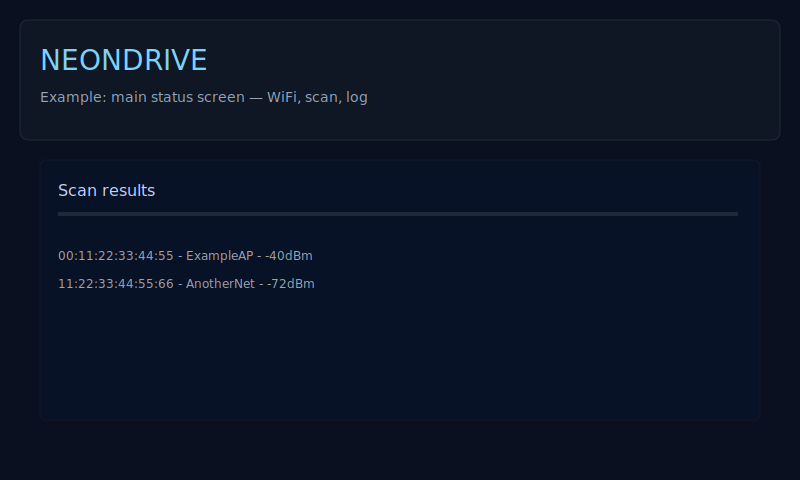
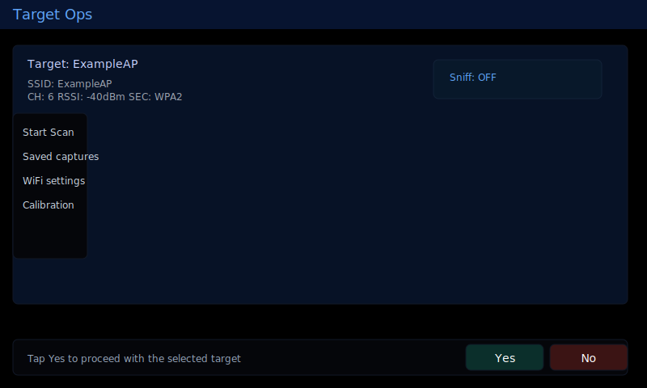
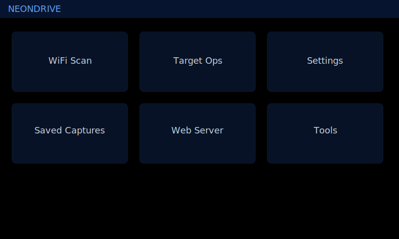
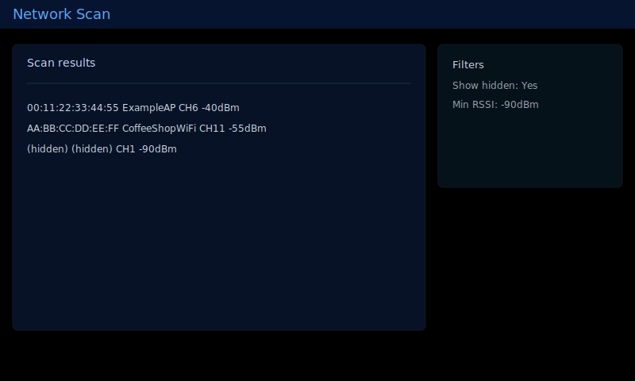
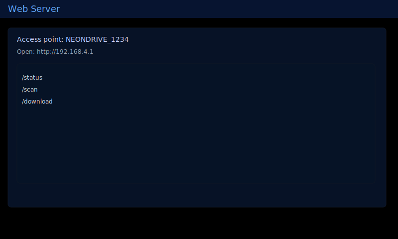

<!-- Badges -->
[](LICENSE) [](https://github.com/neondrive-user/NEONDRIVE/releases) [](https://github.com/neondrive-user/NEONDRIVE/issues) [](https://github.com/neondrive-user/NEONDRIVE/stargazers)

# NEONDRIVE

NEONDRIVE is a multi-target ESP32 firmware project for CYD and select LilyGO boards — built for hands-on hardware hackers who like to tinker, improve, and share.

This repo grew from a love of hacker culture — late-night soldering, curious tinkering, and generous knowledge-sharing. Special thanks and inspiration to the Marauder project, M5porkchop, and Bruce.

What you'll find here:

- Firmware sources for CYD 2.4 / 2.8 / 3.5 and LilyGO devices
- PlatformIO build environments and helper scripts
- Release packaging and `Device-Bins` for easy flashing

---

**Quick Start**

- Flash a prebuilt image from `Device-Bins/` or the Releases page.
- Build locally with PlatformIO (example):

```powershell
python -m pip install -U platformio
python -m platformio run -e firmware_cyd_3_5
python -m platformio run -e firmware_cyd_3_5 -t upload --upload-port <PORT>
```

Replace `<PORT>` with your serial port (Windows `COMx`, Linux `/dev/ttyUSBx`, macOS `/dev/cu.*`). Use `python -m platformio device list` to discover ports.

---

## Why this project feels "hacker"

NEONDRIVE emphasizes reproducible, tweakable firmware over polished, opaque binaries. We favor:

- Clear build steps so anyone can reproduce a firmware image.
- Small, focused changes with well-described commits.
- Sharing credit — many ideas here were inspired by Marauder, M5porkchop, and Bruce.

If that sounds like your kind of project, jump in.

---

## Supported Hardware (overview)

See `docs/HARDWARE_TARGETS.md` for full details. Primary targets include:

- CYD 2.4 / CYD 2.8 / CYD 3.5 (ESP32 variants)
- LilyGO T-Display-S3 (ESP32-S3)
- LilyGO T-Embed CC1101 (ESP32-S3 + radio)

### Device matrix

| Device | PlatformIO Env | Chip | Input | Status |
|---|---|---|---|---|
| CYD 2.4 (ESP32-2432S024) | `firmware_cyd_2_4` | `esp32` | Touch | ✅ Stable |
| CYD 2.8 (ESP32-2432S028) | `firmware_cyd_2_8` | `esp32` | Touch | ✅ Stable |
| CYD 3.5 (ESP32-3248S035R) | `firmware_cyd_3_5` | `esp32` | Touch | ✅ Stable |
| LilyGO T-Display-S3 | `firmware_t_display_s3` | `esp32s3` | Touch + button fallback | ⚠️ Beta |
| LilyGO T-Embed CC1101 | `firmware_t_embed_cc1101` | `esp32s3` | Encoder + buttons | 🚧 Untested |

If you'd like I can expand the table with pinouts, screen sizes, or sample images for each device.

## Workflow — build, test, release

1. Setup

   - Install PlatformIO and toolchain as in `docs/INSTALL.md`.

2. Build

   - Build a single target:

   ```powershell
   python -m platformio run -e firmware_cyd_3_5
   ```

   - Build and flash in one step:

   ```powershell
   python -m platformio run -e firmware_cyd_3_5 -t upload --upload-port <PORT>
   ```

3. Test

   - Monitor serial output:

   ```powershell
   python -m platformio device monitor -p <PORT> -b 115200
   ```

4. Release

   - Use helper scripts to produce release artifacts:

   ```powershell
   python scripts/build_release_bins.py --version vX.Y.Z
   python scripts/build_device_bins.py --version vX.Y.Z
   ```

---

## Branching & Contributions

- Use feature branches and open PRs against `main`.
- Keep commits focused and include clear descriptions.
- Open an issue before larger changes (new hardware, major refactors) so we can coordinate.

See `CONTRIBUTING.md` for details.

---

## Troubleshooting (short)

- Use a data-capable USB cable.
- If flashing fails, try holding BOOT or toggling RESET during upload.
- If CYD 3.5 touch is off, remove the SD calibration file (`/touch_cal_cyd35.json`) and reboot.

---

## Screenshots & mockups

Drop screenshots into `docs/mockups/` and reference them here. Example markdown:

```markdown

```

If you want, I can add screenshots to the README once you add images to `docs/mockups/`.


Example screenshots (added):












## License & Credits

This project is licensed under `LICENSE` in this repo.

Thanks to the broader maker community for inspiration — especially Marauder, M5porkchop, and Bruce.

---

See also:

- [docs/INSTALL.md](docs/INSTALL.md)
- [docs/HARDWARE_TARGETS.md](docs/HARDWARE_TARGETS.md)
- [Device-Bins/](Device-Bins/)
